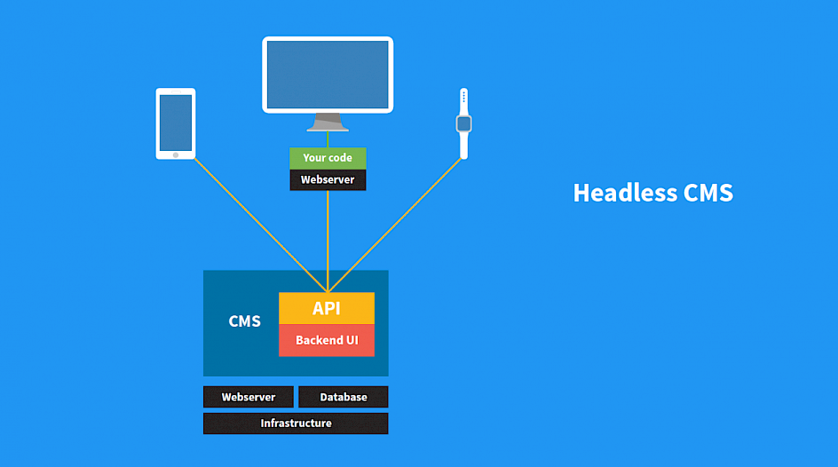

# [Umbraco Headless Playground](https://github.com/mzajkowski/umbraco-headless-playground) &middot; 

A playground with some PoCs for working with Umbraco as a headless CMS (with Xamarin and .NET Core clients).

  

---

## Roadmap:

- REST based headless approach using [HeadRest](https://github.com/mzajkowski/umbraco-headrest) package
- Custom API with Azure CDN
- Nice-to-have: GraphQL, protobuf-net & Swagger examples